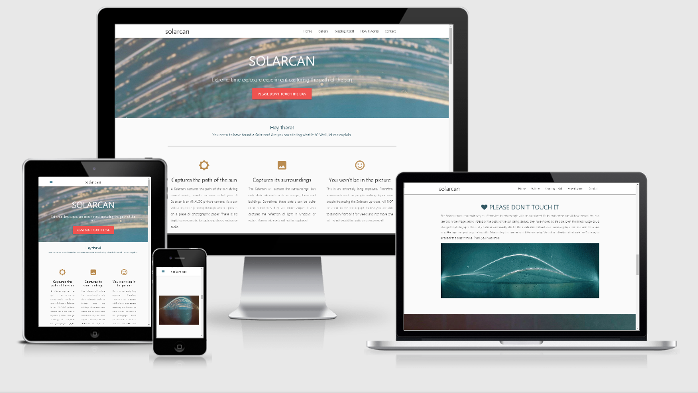
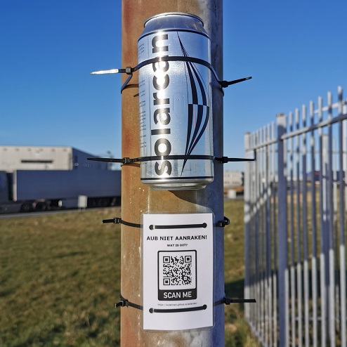

# SOLARCAN
## Personal project

#### Click [HERE](https://suzannenl.github.io/solarcan/) for a link to the live website.

### Project goal
This website was built with the intention to inform people about Solarcans. When putting up a Solarcan, I also put up a small sign with a QR-code, that redirects people to this website. I do this to prevent people from moving or removing Solarcans.  

### Technologies
This was website was built using a Materialize template and therefore uses HTML, CSS (Materialize), Javascript (jQuery).

